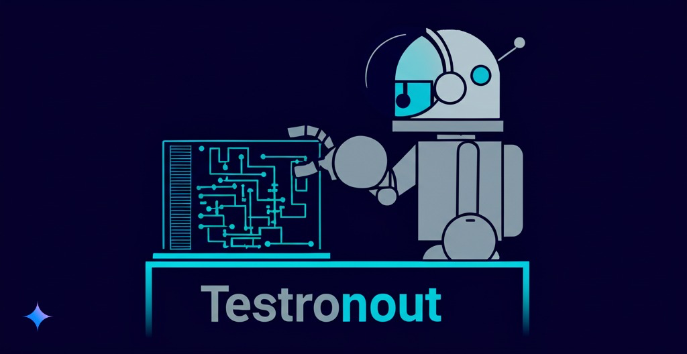
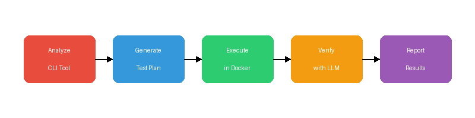
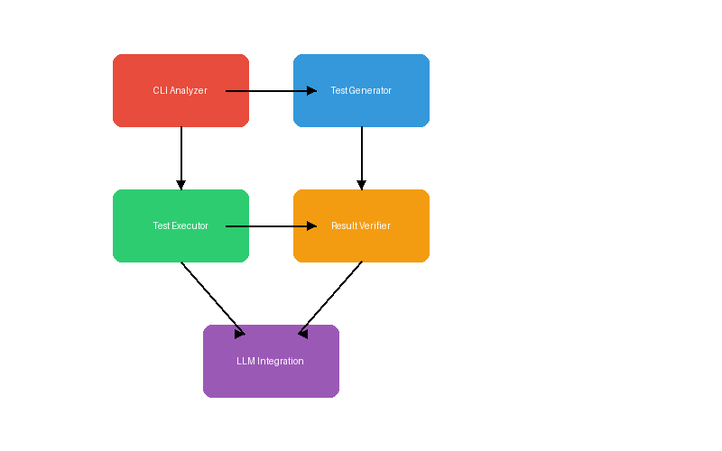

[](https://opensource.org/licenses/MIT)
[](https://github.com/your-username/testronaut)
[](https://github.com/your-username/testronaut)
[](https://github.com/your-username/testronaut/actions/workflows/main.yml)
[](https://github.com/your-username/testronaut/actions/workflows/docs.yml)
[](https://github.com/your-username/testronaut/actions/workflows/security.yml)
[](http://makeapullrequest.com)
[](https://github.com/your-username/testronaut/issues)
[](https://github.com/your-username/testronaut/graphs/commit-activity)
[](https://github.com/your-username/testronaut/discussions)

# Testronaut - testronauting

<div align="center">
  
  <p><em>AI-powered testing for CLI tools</em></p>
</div>

Testronaut is an AI-powered, containerized framework for end-to-end testing of CLI tools. It analyzes commands, generates test plans, verifies outputs semantically with LLMs, and runs everything safely in Docker.

## Current Status

- **Phase 000: Project Setup** ✅ Completed (100%)
- **Phase 001: Testing Infrastructure** ✅ Completed (100%)
- **Phase 002: CI/CD Pipeline** ✅ Completed (100%)
- **Phase 003: Core Architecture** ✅ Completed (100%)
- **Phase 004: CLI Analysis Engine** ✅ Completed (100%)
- **Phase 005: Test Plan Generator** 🚧 In Progress (10%)
- **Current Version:** 0.4.0
- **Test Coverage:** 72%
- **Last Update:** March 24, 2024

# testronauting

An intelligent, AI-driven framework for automating end-to-end testing of command-line interface (CLI) tools.

## Overview

testronauting replaces traditional, brittle test scripts with an AI-powered system that:

1. **Analyzes CLI tools** to understand their structure and capabilities
2. **Generates comprehensive test plans** covering various use cases and edge conditions
3. **Executes tests in isolated Docker containers** for safety and reproducibility
4. **Verifies results using semantic comparison** rather than exact string matching

This approach dramatically reduces the effort required to create and maintain CLI tests while providing more robust coverage.

<div align="center">
  
  <p><em>Testronaut's end-to-end testing workflow</em></p>
</div>

## Key Features

- **AI-Based Command Analysis**: Automatically understand CLI structure from help text
- **Intelligent Test Generation**: Create comprehensive test plans with minimal input
- **Containerized Execution**: Run tests in isolated Docker environments
- **Semantic Result Verification**: Compare outputs based on meaning, not exact matches
- **Model Flexibility**: Support for cloud LLMs (OpenAI, Anthropic) and local LLMs via `llama-cpp-python` (GGUF models).
- **Comprehensive CI/CD**: Automated testing, documentation, and security scanning

## Getting Started

### Development Setup

We use [uv](https://github.com/astral-sh/uv) for fast, reliable Python packaging. Make sure it's installed first:

```bash
# Install uv
curl -L --proto '=https' --tlsv1.2 -sSf https://astral.sh/uv/install.sh | sh
```

Then set up the project:

```bash
# Clone the repository
git clone https://github.com/yourusername/testronaut.git
cd testronaut

# Run the setup script (creates venv and installs dependencies with uv)
./setup.sh

# Activate the virtual environment
source .venv/bin/activate
```

Alternatively, set up manually with uv:

```bash
# Create virtual environment
uv venv

# Install the package in development mode
uv pip install -e ./src

# Install development dependencies
uv pip install pytest pytest-cov mypy ruff pre-commit
```

### Installation for Users

```bash
# Install from PyPI using uv (recommended)
uv pip install testronauting

# Or install with pip
pip install testronaut

# For local model support (using llama-cpp-python)
uv pip install "testronaut[local-llm]"

# Or with pip:
pip install "testronaut[local-llm]"
```

### Configuring LLMs

Testronaut requires an LLM for analysis and verification. You can configure cloud providers (OpenAI, Anthropic) or use local models via `llama-cpp-python`.

**Using Local Models (llama-cpp):**

1.  **Install Local Support:**
    ```bash
    uv pip install "testronaut[local-llm]"
    # or: pip install "testronaut[local-llm]"
    ```

2.  **Add a Model:** Download a GGUF model (e.g., from Hugging Face Hub) and register it:
    ```bash
    # Add by downloading from Hub (repo_id/filename.gguf)
    testronaut config llm add TheBloke/Mistral-7B-Instruct-v0.2-GGUF/mistral-7b-instruct-v0.2.Q4_K_M.gguf --name mistral-7b

    # Add using a local path
    testronaut config llm add /path/to/your/local/model.gguf --name my-local-model
    ```

3.  **List Registered Models:**
    ```bash
    testronaut config llm list
    ```

4.  **Set Default Local Model:** This command also sets the active provider to `llama-cpp`.
    ```bash
    testronaut config llm set mistral-7b
    ```

5.  **Remove a Registered Model:**
    ```bash
    testronaut config llm remove my-local-model --delete-file # Optionally delete the file
    ```

**Using Cloud Providers:**

*   Configure API keys via environment variables (`OPENAI_API_KEY`, `ANTHROPIC_API_KEY`) or directly in the configuration file (`~/.testronaut/config.yaml`).
*   Set the active provider in the configuration file:
    ```yaml
    # ~/.testronaut/config.yaml
    llm:
      provider: openai # or anthropic
      # ... other settings ...
    ```

*   Use `testronaut config show` to view the current configuration.

### Running Tests

Use uv to run tests for better performance:

```bash
# Run tests
uv run pytest

# Run tests with coverage
uv run pytest --cov=src/testronaut
```

### Basic Usage

```bash
# Analyze a CLI tool and generate a test plan
testronaut analyze --tool my-cli-tool

# Generate expected results (baseline)
testronaut generate --plan my-test-plan

# Verify against expected results
testronaut verify --plan my-test-plan

# Generate a test report
testronaut report --plan my-test-plan
```

## Use Cases

testronauting is ideal for:

- **CLI Tool Developers**: Ensure your tools work as expected across environments
- **DevOps Engineers**: Validate CLI tools in CI/CD pipelines
- **QA Engineers**: Automate testing of command-line interfaces
- **Open Source Maintainers**: Scale testing of CLI projects with minimal effort

## Technical Architecture

<div align="center">
  
  <p><em>Testronaut's component architecture</em></p>
</div>

The system consists of five main components:

1. **CLI Analyzer**: Parses and understands command structure
   - Two-phase command discovery and analysis
   - Robust cycle detection for complex command hierarchies
   - Verbose logging and progress reporting
   - LLM-enhanced fallback for challenging CLI formats
2. **Test Generator**: Creates comprehensive test plans
3. **Test Executor**: Runs tests in Docker containers
4. **Result Verifier**: Compares expected vs. actual results
5. **LLM Integration**: Powers the AI capabilities

## CI/CD Infrastructure

Testronaut uses GitHub Actions for comprehensive CI/CD pipelines:

### Workflows
- **Main Workflow**: Runs tests and code quality checks on all pull requests and pushes to main branch
- **Documentation Workflow**: Builds and publishes documentation to GitHub Pages
- **Release Workflow**: Creates releases and publishes packages to PyPI
- **Security Workflow**: Performs security scanning with Safety, Bandit, and CodeQL

### Local Testing Tools
We provide several scripts to test workflows locally before pushing:

```bash
# Test GitHub Actions workflows with local validation
./ci/test-workflows.sh --validate

# Run security scanning locally
./ci/test-security.sh

# Build documentation locally
./ci/test-docs.sh
```

### Key Features
- Testing on Python 3.13 for faster workflows
- Fast dependency management with astral-sh/setup-uv@v5
- Comprehensive security scanning
- Automated documentation generation and publishing
- Efficient caching for faster workflow runs

## Roadmap

Check our [CHANGELOG.md](CHANGELOG.md) for recent updates and our project board for upcoming features.

## Support

If you're having issues or have questions, please:

- Check the [documentation](https://github.com/your-username/testronaut/wiki)
- Open an [issue](https://github.com/your-username/testronaut/issues/new/choose)
- Join our [discussions](https://github.com/your-username/testronaut/discussions)

## Contributing

We welcome contributions! Please see [CONTRIBUTING.md](CONTRIBUTING.md) for detailed guidelines on how to contribute to Testronaut.

Key points:
- We use [uv](https://github.com/astral-sh/uv) for package management
- Follow test-driven development principles
- Use pre-commit hooks for code quality
- Maintain code coverage above our current baseline

## License

This project is licensed under the MIT License - see the [LICENSE](LICENSE) file for details.

## Contact

- **Author**: Ulrich Diedrichsen
- **Email**: uli@moinsen.dev
- **Website**: www.moinsen.dev
