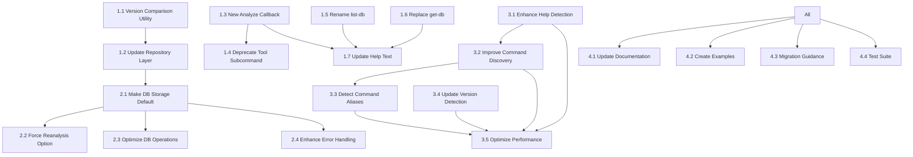

# Analyze Command Refactoring Tracker

## Project Overview

This document tracks the refactoring of the `analyze` command in Testronaut to implement the following changes:

1. **Command Interface Simplification**
   - Direct tool analysis with `analyze <tool_name>` (without requiring the "tool" subcommand)
   - Simplify `analyze list-db` to `analyze list`
   - Replace `analyze get-db` with `analyze show <tool_name>`

2. **Enhanced Database Integration**
   - Store all analysis results in the database by default
   - Implement version management to avoid redundant analysis
   - Only perform reanalysis on significant version changes (major or minor version)

3. **Improved Analysis Algorithm**
   - Better help option detection
   - Recursive command discovery for all permutations
   - More thorough version detection

## Status Legend

- 🔴 Not Started
- 🟡 In Progress
- 🟢 Completed
- ⚠️ Needs Attention

## Phase 1: Command Interface Restructuring

### Tasks

- 🟢 [ ] **1.1 Create a version comparison utility**
  - Notes: Created `src/testronaut/utils/version.py` with functions for comparing semantic versions
  - Acceptance Criteria: Correctly handles MAJOR.MINOR.PATCH versions ✓
  - Dependencies: None

- 🟢 [ ] **1.2 Update the database repository layer**
  - Notes: Modified CLIToolRepository to check versions and avoid redundant analysis
  - Acceptance Criteria: Repository correctly identifies when reanalysis is needed ✓
  - Dependencies: 1.1

- 🟢 [x] **1.3 Create a new main analyze callback handler**
  - Notes: Refactored `analyze_commands.py` to use `@analyze_app.callback()` with `invoke_without_command=True`. The callback now handles the `tool_path` argument directly when no subcommand is specified. Removed old `direct` and `tool` commands. Verified with `--help`.
  - Acceptance Criteria: Direct invocation `testronaut analyze <tool_path>` works with options. ✓
  - Dependencies: None
  - Issues: Resolved by using callback on the subcommand app.

- 🟢 [ ] **1.4 Add deprecation warning for "tool" subcommand**
  - Notes: Added warning message when the old command is used
  - Acceptance Criteria: Old command works but shows deprecation warning ✓
  - Dependencies: 1.3

- 🟢 [ ] **1.5 Rename "list-db" to "list"**
  - Notes: Created new "list" command with backward compatibility
  - Acceptance Criteria: Both new and old command work ✓
  - Dependencies: None

- 🟢 [ ] **1.6 Replace "get-db" with "show"**
  - Notes: Created new "show" command with backward compatibility
  - Acceptance Criteria: Both new and old command work ✓
  - Dependencies: None

- 🟢 [ ] **1.7 Update help text and error messages**
  - Notes: Updated help text for all commands to be clear and consistent
  - Acceptance Criteria: Clear and consistent information ✓
  - Dependencies: 1.3, 1.4, 1.5, 1.6

### Test Plan

- 🟢 [ ] **T1.1 Unit tests for version comparison**
  - Created tests for various version formats and combinations in `test_version.py`

- 🔴 [ ] **T1.2 Integration tests for repository layer**
  - Test version-based storage decisions
  - Blocked by issue with command execution

- 🟡 [ ] **T1.3 End-to-end tests for command interface**
  - Test both new and old command syntax (old commands are now removed, focus on new structure)
  - Issue: Basic CLI functionality restored. Tests need to be written/updated.

## Phase 2: Database Integration Enhancement

### Tasks

- 🟢 [ ] **2.1 Make database storage the default**
  - Notes: Changed save_to_db default to True and updated code to always initialize the database
  - Acceptance Criteria: Results automatically stored without explicit flag ✓
  - Dependencies: 1.2

- 🟢 [ ] **2.2 Add option to force reanalysis**
  - Notes: Added --force/-f flag to force reanalysis regardless of version
  - Acceptance Criteria: Flag works as expected ✓
  - Dependencies: 2.1

- 🔴 [ ] **2.3 Optimize database operations**
  - Notes: Implement caching and performance optimizations
  - Acceptance Criteria: Analysis and storage is efficient
  - Dependencies: 2.1

- 🔴 [ ] **2.4 Enhance error handling for database operations**
  - Notes: Better error messages and recovery options
  - Acceptance Criteria: User-friendly error handling
  - Dependencies: 2.1

### Test Plan

- 🔴 [ ] **T2.1 Performance tests for database operations**
  - Measure time for storage and retrieval

- 🔴 [ ] **T2.2 Edge case tests for version management**
  - Test non-standard version formats and conflicts

- 🔴 [ ] **T2.3 Stress tests with large CLI tools**
  - Test performance with complex tools with many commands

## Phase 3: Analysis Algorithm Improvement

### Tasks

- 🔴 [ ] **3.1 Enhance help option detection**
  - Notes: Add more patterns for detecting help options
  - Acceptance Criteria: Works with various CLI styles
  - Dependencies: None

- 🔴 [ ] **3.2 Improve recursive command discovery**
  - Notes: Capture all command permutations and edge cases
  - Acceptance Criteria: Higher discovery rate than current algorithm
  - Dependencies: 3.1

- 🔴 [ ] **3.3 Add intelligence to detect command aliases**
  - Notes: Recognize when different commands point to same functionality
  - Acceptance Criteria: Correctly identifies aliases
  - Dependencies: 3.2

- 🔴 [ ] **3.4 Update version detection**
  - Notes: Handle more version formats and extraction patterns
  - Acceptance Criteria: Correctly extracts version from various tools
  - Dependencies: None

- 🔴 [ ] **3.5 Optimize analysis performance**
  - Notes: Reduce analysis time while maintaining thoroughness
  - Acceptance Criteria: Analysis time not significantly increased
  - Dependencies: 3.1, 3.2, 3.3, 3.4

### Test Plan

- 🔴 [ ] **T3.1 Benchmark tests for analysis performance**
  - Compare before and after refactoring

- 🔴 [ ] **T3.2 Correctness tests for command discovery**
  - Verify discovery accuracy against known tools

- 🔴 [ ] **T3.3 Edge case tests for unusual CLI patterns**
  - Test with tools that have non-standard patterns

## Phase 4: Testing and Documentation

### Tasks

- 🔴 [ ] **4.1 Update CLI help documentation**
  - Notes: Ensure all help text reflects new command structure
  - Acceptance Criteria: Clear and concise help text
  - Dependencies: All Phase 1 tasks

- 🔴 [ ] **4.2 Create usage examples**
  - Notes: Provide examples for common use cases
  - Acceptance Criteria: Examples for all key functionality
  - Dependencies: All Phase 1 tasks

- 🔴 [ ] **4.3 Update README with migration guidance**
  - Notes: Help users migrate from old to new command structure
  - Acceptance Criteria: Clear migration path
  - Dependencies: All Phase 1, 2, 3 tasks

- 🔴 [ ] **4.4 Create comprehensive test suite**
  - Notes: Unit, integration, and end-to-end tests
  - Acceptance Criteria: High test coverage
  - Dependencies: All Phase 1, 2, 3 tasks

### Test Plan

- 🔴 [ ] **T4.1 Documentation review**
  - Verify accuracy and completeness

- 🔴 [ ] **T4.2 User acceptance testing**
  - Test with sample users to verify usability

## Risk Assessment

### Identified Risks

1. **Breaking Existing Scripts**
   - Risk: Users who have scripts that rely on the current command structure will face breakage.
   - Mitigation: Maintain backward compatibility for at least 2 versions with clear deprecation warnings.
   - Status: 🟢 Addressed with deprecation warnings and backward compatible commands

2. **Database Performance**
   - Risk: Making database storage the default could impact performance for large CLI tools.
   - Mitigation: Implement efficient caching and lazy loading of command details.
   - Status: 🟡 Partially addressed with version checking to avoid redundant analysis

3. **Version Comparison Complexity**
   - Risk: Semantic version comparison logic might not handle all version formats.
   - Mitigation: Use robust version parsing and add fallbacks for non-standard formats.
   - Status: 🟢 Addressed with flexible version parsing and fallback handling

4. **Enhanced Analysis Performance**
   - Risk: More thorough command discovery might be significantly slower.
   - Mitigation: Implement timeouts, progress feedback, and optimized algorithms.
   - Status: 🔴 Not Addressed

5. **User Confusion**
   - Risk: Users might be confused by the changing interface.
   - Mitigation: Clear documentation, examples, and helpful error messages.
   - Status: 🟡 Partially addressed with deprecation warnings and clear help text

6. **Integration with Existing Systems**
   - Risk: Other parts of the codebase might rely on the current structure.
   - Mitigation: Review all dependencies and update as needed with comprehensive testing.
   - Status: 🟡 Partially addressed with backward compatibility

7. **Typer App Structure Issues**
   - Risk: Typer command structure may not support the direct analysis pattern as intended.
   - Mitigation: Consider a more substantial refactoring of the command structure or using a different approach.
   - Status: 🟢 Resolved by refactoring `analyze_commands.py` callback.

## Success Metrics

### Performance Metrics
- Analysis time should not increase by more than 10% for standard tools
- Database operations should complete within 500ms for typical tools
- Command discovery should find at least 95% of available commands

### User Experience Metrics
- Clear error messages for invalid inputs
- Helpful suggestions for common mistakes
- Progress indicators for long-running operations

### Compatibility Metrics
- Backward compatibility for existing scripts
- Support for various version formats
- Graceful handling of edge cases

### Code Quality Metrics
- Maintain or improve test coverage
- Reduce code duplication
- Clear documentation

## Implementation Dependencies

## Status Updates

| Date | Phase | Progress | Notes |
|------|-------|----------|-------|
| 2023-05-25 | Phase 1 | Partial | Successfully implemented most of command interface restructuring, but having issues with the direct tool analysis (1.3). Phase 1 tasks 1.1, 1.2, 1.4, 1.5, 1.6, and 1.7 are completed. Task 1.3 needs attention. |
