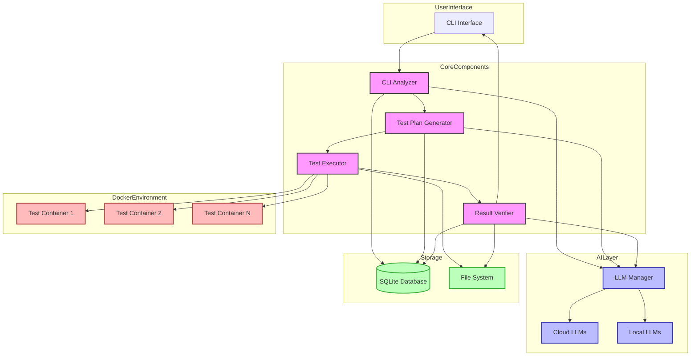

# Architecture Diagram

This architecture diagram illustrates the main components of the AI-CLI-Testing tool and how they interact:

1. **User Interface**: A command-line interface for interacting with the system
2. **Core Components**:
   - CLI Analyzer: Parses and understands CLI tools using AI
   - Test Generator: Creates test plans based on CLI analysis
   - Test Executor: Runs tests in Docker containers
   - Result Verifier: Compares expected vs. actual results
3. **AI Layer**: Manages integration with both cloud and local LLMs
4. **Storage**: SQLite database for structured data and file system for artifacts
5. **Docker Environment**: Isolated containers for test execution

The arrows indicate the flow of data and control between components. The system follows a sequential workflow but with feedback loops for verification and reporting.