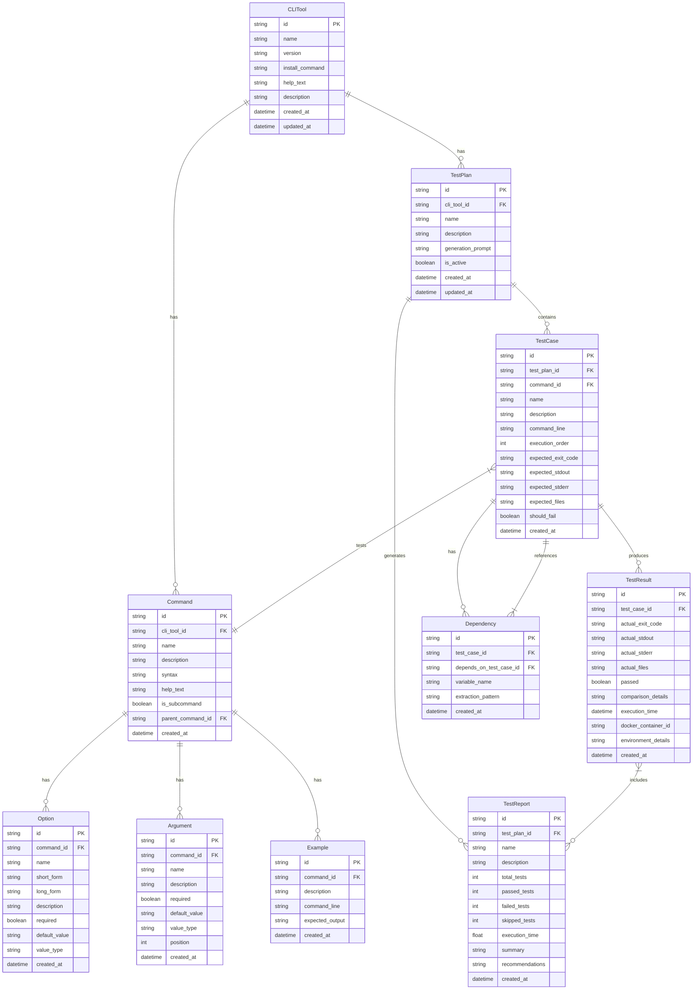

# Data Model Diagram

This entity-relationship diagram shows the data model for the AI-CLI-Testing tool:

1. **CLITool**: Represents the command-line tool being tested, with its metadata
2. **Command**: Individual commands provided by the CLI tool
3. **Option**: Command-line options for commands (e.g., --verbose, -f)
4. **Argument**: Positional arguments for commands
5. **Example**: Example usages of commands with expected outputs
6. **TestPlan**: Collection of test cases for a CLI tool
7. **TestCase**: Individual test scenario with command line and expected outputs
8. **Dependency**: Relationship between test cases (e.g., one test depends on another)
9. **TestResult**: Actual outputs and comparison results from test execution
10. **TestReport**: Summary of test execution results with insights

The relationships show how these entities are connected, such as:
- A CLI tool has many commands
- Commands have options and arguments
- Test plans contain test cases
- Test cases produce test results
- Test cases can depend on other test cases
- Test reports summarize test results

This model supports the full workflow from CLI analysis to test execution and reporting.