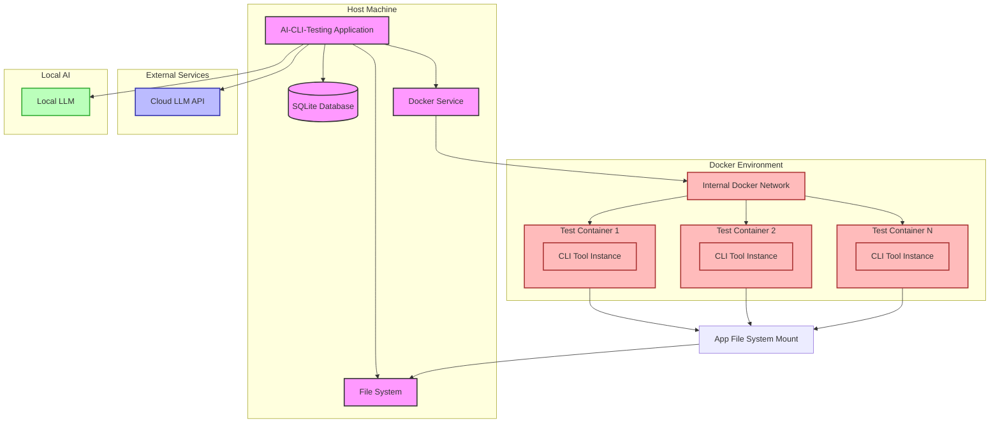

# Deployment Diagram

This deployment diagram illustrates how the AI-CLI-Testing tool is deployed and how its components interact in a runtime environment:

1. **Host Machine**:
   - Contains the AI-CLI-Testing application
   - SQLite database for persistent storage
   - File system for test artifacts
   - Docker service for managing containers

2. **Docker Environment**:
   - Internal Docker network
   - Multiple test containers running in isolation
   - Each container has its own instance of the CLI tool being tested
   - Containers have limited access to host file system through mounts

3. **External Services**:
   - Cloud LLM APIs (OpenAI, Anthropic, etc.)
   - Used for AI-powered analysis, generation, and verification

4. **Local AI**:
   - Local LLM deployment for cost-efficient operation
   - Alternative to cloud APIs for sensitive environments

The deployment shows how the system maintains isolation between test executions using Docker containers while still allowing for efficient data exchange through controlled file system mounts. It also illustrates the flexibility of using either cloud or local LLMs depending on requirements.