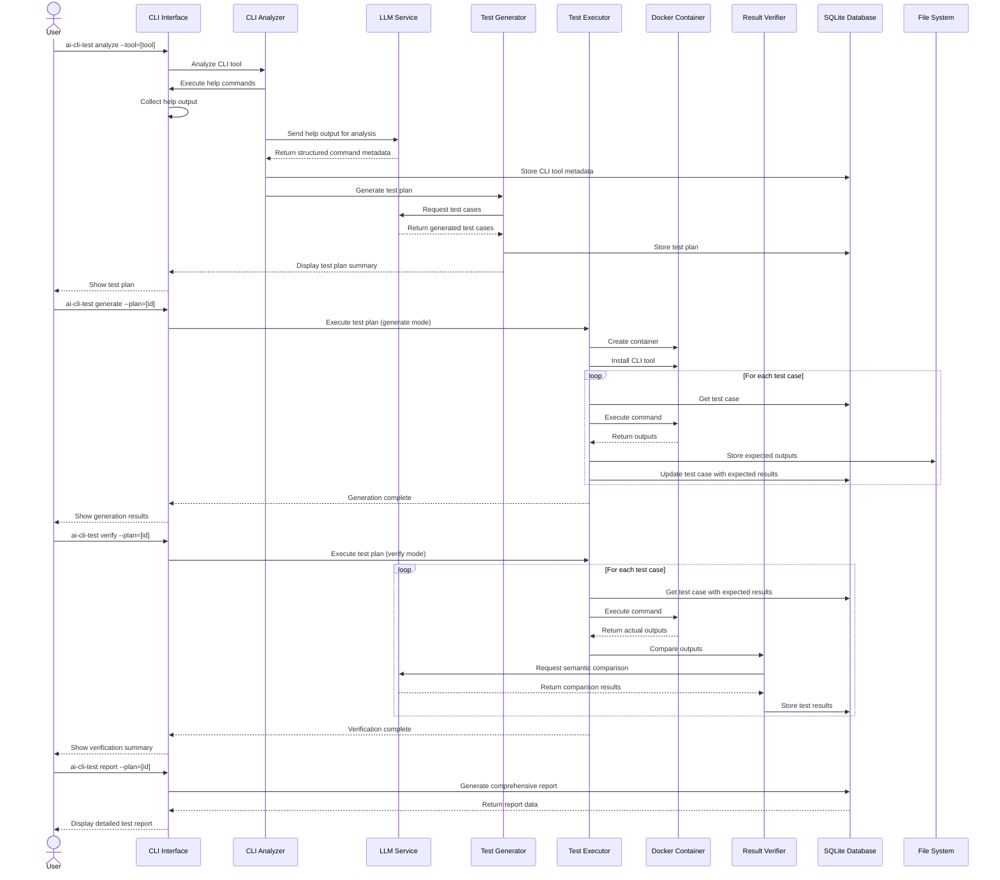

# Sequence Diagram

This sequence diagram illustrates the complete workflow of the AI-CLI-Testing tool:

1. **Analysis Phase**
   - User requests CLI tool analysis
   - System extracts help text and sends to LLM
   - LLM returns structured command metadata
   - System generates a test plan

2. **Generation Phase**
   - User initiates test generation
   - System creates Docker container and installs CLI tool
   - System executes each test case and captures expected outputs
   - Expected results are stored for later verification

3. **Verification Phase**
   - User initiates test verification
   - System re-executes test cases and captures actual outputs
   - LLM performs semantic comparison between expected and actual outputs
   - Results are stored in the database

4. **Reporting Phase**
   - User requests a test report
   - System generates comprehensive report from results
   - Report is displayed to the user

The diagram shows interaction between all major components and how data flows through the system.