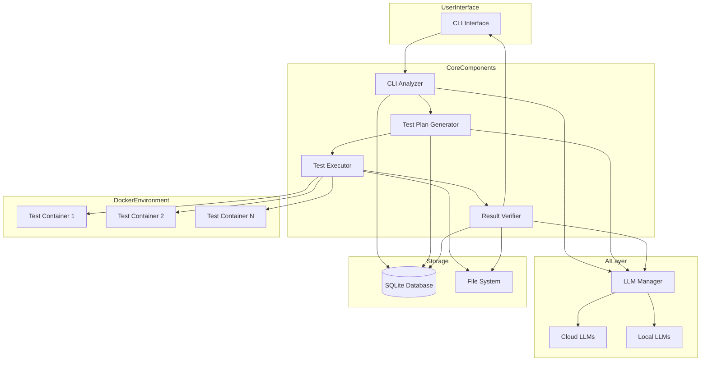
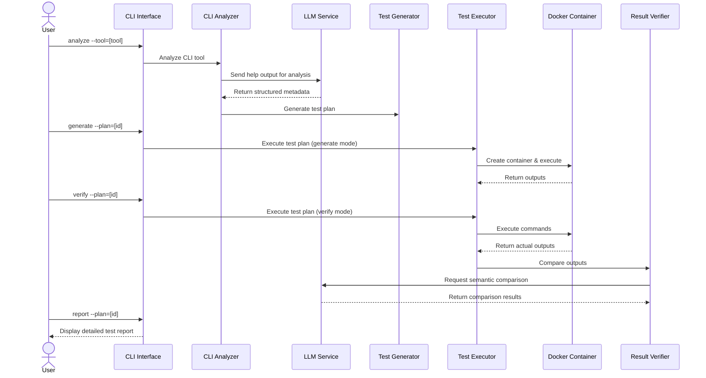
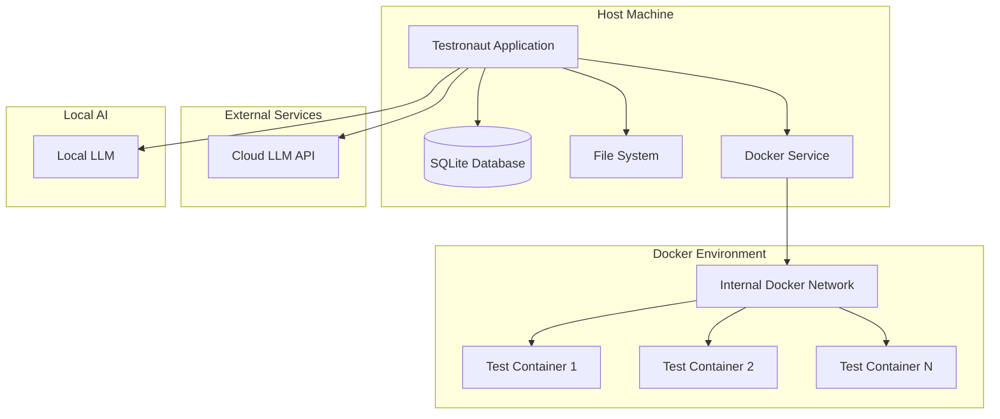

# System Patterns

## Architecture Overview

Testronaut follows a modular architecture with clearly defined components and interfaces. The system is designed as a command-line application with several interconnected components that handle different aspects of the testing process.

## Key Design Patterns

### 1. Component-Based Architecture
The system is structured around distinct components with well-defined responsibilities:
- **CLI Analyzer**: Parses and understands CLI tools using AI
- **Test Generator**: Creates test plans based on CLI analysis
- **Test Executor**: Runs tests in Docker containers
- **Result Verifier**: Compares expected vs. actual results
- **LLM Manager**: Handles integration with AI models

Each component operates independently but communicates through defined interfaces, enabling modular development and testing.

### 2. Repository Pattern
Data access is abstracted through repositories that provide a consistent interface to the underlying storage:
- **CLIToolRepository**: Manages CLI tool metadata
- **TestPlanRepository**: Handles test plans and cases
- **TestResultRepository**: Stores and retrieves test results

This pattern isolates data access logic and makes it easier to change the storage implementation in the future.

### 3. Factory Pattern
The system uses factories to create complex objects:
- **ContainerFactory**: Creates Docker containers with appropriate configuration
- **LLMClientFactory**: Creates appropriate LLM clients based on configuration
- **TestCaseFactory**: Generates test cases based on CLI analysis

This pattern centralizes object creation logic and makes the system more extensible.

### 4. Strategy Pattern
Different strategies can be used for various operations:
- **VerificationStrategy**: Different approaches to comparing results
- **LLMProviderStrategy**: Different LLM providers (cloud, local)
- **ContainerizationStrategy**: Different ways to isolate test execution

This pattern allows for flexibility in implementation details while keeping the core workflow consistent.

### 5. Observer Pattern
The system uses observers to react to events:
- **TestExecutionObserver**: Notifies listeners about test execution progress
- **AnalysisProgressObserver**: Reports on CLI analysis progress
- **ResultVerificationObserver**: Monitors result verification

This pattern enables loose coupling between components while maintaining coordination.

## Data Flow

The system follows a sequential data flow pattern:

1. **CLI Tool Analysis**:
   - Input: CLI tool name or path
   - Processing: Extract help text, analyze with LLM
   - Output: Structured command metadata

2. **Test Plan Generation**:
   - Input: Command metadata
   - Processing: Generate test cases with LLM
   - Output: Test plan with cases

3. **Test Execution**:
   - Input: Test plan
   - Processing: Execute commands in Docker containers
   - Output: Captured outputs and artifacts

4. **Result Verification**:
   - Input: Expected and actual outputs
   - Processing: Compare semantically with LLM
   - Output: Verification results

5. **Reporting**:
   - Input: Verification results
   - Processing: Generate insights and recommendations
   - Output: Comprehensive test report

## Sequence Flow

## Deployment Pattern

Testronaut follows a client-side deployment pattern:

## Technical Decisions

1. **Python as Primary Language**: Python is chosen for its excellent support for AI/ML, ease of use, and robust CLI libraries.

2. **SQLite for Storage**: SQLite provides a lightweight, file-based database that doesn't require a separate server.

3. **Docker for Isolation**: Docker provides consistent, isolated environments for test execution.

4. **LangChain for LLM Integration**: LangChain simplifies working with different LLM providers.

5. **Typer for CLI Interface**: Typer offers a modern, type-annotated approach to building CLI applications.

6. **FastAPI for Future Web Interface**: FastAPI will provide a high-performance, easy-to-develop web interface when needed.