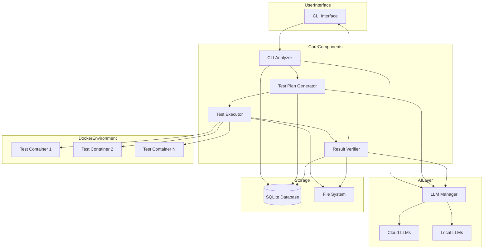
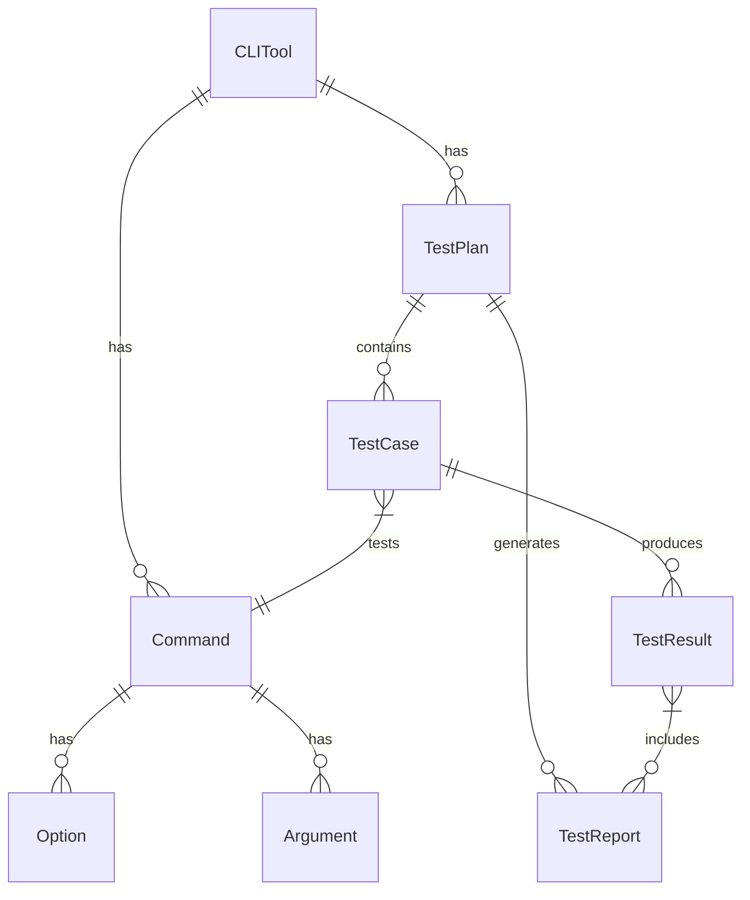
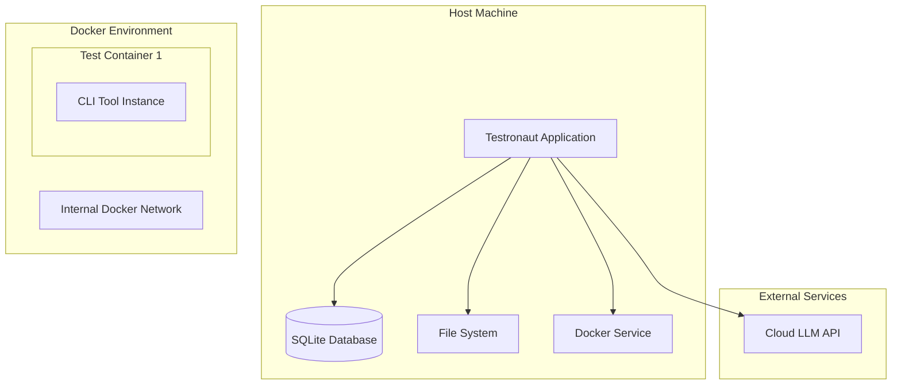
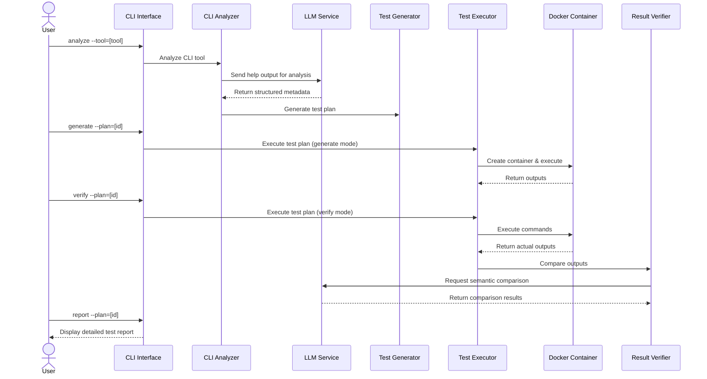
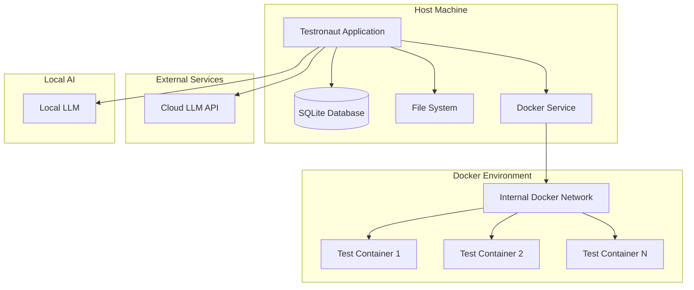

# System Patterns

## Architecture Overview

Testronaut follows a domain-driven design approach with clear separation of concerns. The architecture is structured around a modular core with well-defined interfaces between components.



## Data Model

The core data model is structured around CLI tools, commands, test plans, and results.



## Core Design Patterns

### Domain-Driven Design (DDD)

The application is structured around the core domain of CLI testing:

1. **Domain Layer**: Contains the business logic and entities
   - CLI tool analysis
   - Test plan generation
   - Test execution
   - Result verification

2. **Application Layer**: Coordinates activities
   - Use cases for each major operation
   - Service orchestration
   - Event handling

3. **Infrastructure Layer**: Provides technical capabilities
   - Database access
   - Docker integration
   - LLM service connections
   - File system operations

4. **Interface Layer**: User interaction
   - CLI interface
   - API endpoints (future)
   - Reporting interface

### Repository Pattern

The application uses the repository pattern to abstract data access:

```python
# Abstract repository
class TestPlanRepository(Protocol):
    def get(self, id: str) -> TestPlan:
        ...

    def save(self, test_plan: TestPlan) -> str:
        ...

    def list(self, filter_criteria: dict) -> List[TestPlan]:
        ...

# Concrete implementation
class SQLiteTestPlanRepository:
    def __init__(self, session_factory: SessionFactory):
        self.session_factory = session_factory

    def get(self, id: str) -> TestPlan:
        with self.session_factory() as session:
            return session.query(TestPlan).filter(TestPlan.id == id).first()

    # More implementation details...
```

### Factory Pattern

Factory classes are used to create components with proper dependencies:

```python
class AnalyzerFactory:
    def __init__(self, config: Config, llm_service: LLMService):
        self.config = config
        self.llm_service = llm_service

    def create(self) -> Analyzer:
        # Create and return configured analyzer instance
        return ConcreteAnalyzer(
            llm_service=self.llm_service,
            parser_config=self.config.parser
        )
```

### Strategy Pattern

Different strategies are used for various operations, such as different LLM providers:

```python
class LLMStrategy(Protocol):
    def generate_completion(self, prompt: str) -> str:
        ...

class OpenAIStrategy:
    def generate_completion(self, prompt: str) -> str:
        # Implementation for OpenAI

class AnthropicStrategy:
    def generate_completion(self, prompt: str) -> str:
        # Implementation for Anthropic
```

### Dependency Injection

Dependencies are injected rather than created directly:

```python
class TestExecutor:
    def __init__(
        self,
        docker_service: DockerService,
        file_system: FileSystem,
        test_plan_repository: TestPlanRepository
    ):
        self.docker_service = docker_service
        self.file_system = file_system
        self.test_plan_repository = test_plan_repository

    # Implementation details...
```

## Component Architecture

### Core Components

1. **Data Models (Phase 003)**
   ```
   models/
   ├── base.py             # Base model classes and utilities
   ├── cli_tool.py         # CLI tool and command models
   ├── test_plan.py        # Test plan and test case models
   ├── test_result.py      # Test execution result models
   └── test_report.py      # Test report and analysis models
   ```

2. **Component Interfaces (Phase 003)**
   ```
   interfaces/
   ├── analyzer.py         # CLI analysis interface
   ├── generator.py        # Test generation interface
   ├── executor.py         # Test execution interface
   ├── verifier.py         # Result verification interface
   └── reporter.py         # Report generation interface
   ```

3. **Error Handling and Logging (Phase 003)**
   ```
   utils/
   ├── errors.py           # Custom exceptions and error handlers
   ├── logging.py          # Logging configuration and utilities
   ├── validation.py       # Input validation utilities
   └── monitoring.py       # Performance and health monitoring
   ```

### Core Interfaces

The system uses Python Protocol classes for interface definitions:

```python
# Example interface definition
from typing import Protocol, List

class Analyzer(Protocol):
    def analyze_cli_tool(self, tool_name: str, include_examples: bool = True) -> CLITool:
        """
        Analyze a CLI tool and extract its command structure

        Args:
            tool_name: Name of the CLI tool to analyze
            include_examples: Whether to extract examples from help text

        Returns:
            Structured representation of the CLI tool
        """
        ...

    def update_command_info(self, command: Command) -> Command:
        """
        Update information for a specific command

        Args:
            command: Command to update

        Returns:
            Updated command with additional information
        """
        ...
```

### Error Handling System

The application uses a structured exception hierarchy:

```
TestronautError (base exception)
├── ConfigurationError
│   ├── MissingConfigError
│   └── InvalidConfigError
├── ValidationError
│   ├── InvalidInputError
│   └── SchemaValidationError
├── ExecutionError
│   ├── CommandExecutionError
│   ├── DockerError
│   └── TimeoutError
├── VerificationError
│   ├── ResultMismatchError
│   └── SemanticComparisonError
└── ConnectivityError
    ├── DatabaseError
    ├── LLMServiceError
    └── FileSystemError
```

### Logging System

The application uses structured logging with context:

```python
# Example logging usage
from utils.logging import get_logger

logger = get_logger(__name__)

def process_test_plan(test_plan_id: str) -> None:
    logger.info("Processing test plan", test_plan_id=test_plan_id)

    try:
        # Processing logic
        logger.debug("Test plan loaded", test_case_count=len(test_plan.test_cases))
    except Exception as e:
        logger.error("Test plan processing failed", error=str(e), exc_info=True)
```

## Workflow Patterns

The system follows a sequential workflow pattern, as illustrated in the sequence diagram:

1. **Analysis Phase**: Extract and understand CLI tool structure
2. **Generation Phase**: Create comprehensive test plans
3. **Execution Phase**: Run tests in isolated containers
4. **Verification Phase**: Compare results using semantic matching
5. **Reporting Phase**: Generate detailed test reports

This workflow supports both manual interventions and fully automated test cycles.

## Deployment Model

The application is deployed as a self-contained Python package that manages Docker containers:



## Key Design Patterns

### 1. Component-Based Architecture
The system is structured around distinct components with well-defined responsibilities:
- **CLI Analyzer**: Parses and understands CLI tools using AI
- **Test Generator**: Creates test plans based on CLI analysis
- **Test Executor**: Runs tests in Docker containers
- **Result Verifier**: Compares expected vs. actual results
- **LLM Manager**: Handles integration with AI models

Each component operates independently but communicates through defined interfaces, enabling modular development and testing.

### 2. Repository Pattern
Data access is abstracted through repositories that provide a consistent interface to the underlying storage:
- **CLIToolRepository**: Manages CLI tool metadata
- **TestPlanRepository**: Handles test plans and cases
- **TestResultRepository**: Stores and retrieves test results

This pattern isolates data access logic and makes it easier to change the storage implementation in the future.

### 3. Factory Pattern
The system uses factories to create complex objects:
- **ContainerFactory**: Creates Docker containers with appropriate configuration
- **LLMClientFactory**: Creates appropriate LLM clients based on configuration
- **TestCaseFactory**: Generates test cases based on CLI analysis

This pattern centralizes object creation logic and makes the system more extensible.

### 4. Strategy Pattern
Different strategies can be used for various operations:
- **VerificationStrategy**: Different approaches to comparing results
- **LLMProviderStrategy**: Different LLM providers (cloud, local)
- **ContainerizationStrategy**: Different ways to isolate test execution

This pattern allows for flexibility in implementation details while keeping the core workflow consistent.

### 5. Observer Pattern
The system uses observers to react to events:
- **TestExecutionObserver**: Notifies listeners about test execution progress
- **AnalysisProgressObserver**: Reports on CLI analysis progress
- **ResultVerificationObserver**: Monitors result verification

This pattern enables loose coupling between components while maintaining coordination.

## Data Flow

The system follows a sequential data flow pattern:

1. **CLI Tool Analysis**:
   - Input: CLI tool name or path
   - Processing: Extract help text, analyze with LLM
   - Output: Structured command metadata

2. **Test Plan Generation**:
   - Input: Command metadata
   - Processing: Generate test cases with LLM
   - Output: Test plan with cases

3. **Test Execution**:
   - Input: Test plan
   - Processing: Execute commands in Docker containers
   - Output: Captured outputs and artifacts

4. **Result Verification**:
   - Input: Expected and actual outputs
   - Processing: Compare semantically with LLM
   - Output: Verification results

5. **Reporting**:
   - Input: Verification results
   - Processing: Generate insights and recommendations
   - Output: Comprehensive test report

## Sequence Flow



## Deployment Pattern

Testronaut follows a client-side deployment pattern:



## Technical Decisions

1. **Python as Primary Language**: Python is chosen for its excellent support for AI/ML, ease of use, and robust CLI libraries.

2. **SQLite for Storage**: SQLite provides a lightweight, file-based database that doesn't require a separate server.

3. **Docker for Isolation**: Docker provides consistent, isolated environments for test execution.

4. **LangChain for LLM Integration**: LangChain simplifies working with different LLM providers.

5. **Typer for CLI Interface**: Typer offers a modern, type-annotated approach to building CLI applications.

6. **FastAPI for Future Web Interface**: FastAPI will provide a high-performance, easy-to-develop web interface when needed.

## Current Architectural State

The Testronaut architecture has evolved substantially through Phase 3 (Core Architecture) and Phase 4 (CLI Analysis Engine):

### Implemented Components:

1. **Core Framework**
   - CLI application using Typer
   - Factory pattern for component creation
   - Repository pattern for data access
   - Dependency injection for component integration
   - Configuration management
   - Comprehensive logging

2. **LLM Service**
   - Provider-based architecture
   - Support for OpenAI, Anthropic, and mock providers
   - Task-specific model selection
   - Structured JSON output generation
   - Error handling and retries

3. **CLI Analyzer**
   - Standard analyzer implementation
   - Command extraction and parsing
   - Subcommand detection and hierarchy
   - Command relationships and ID tracking
   - Help text processing for various formats
   - Analysis output serialization

### Current Development Focus:

We are now implementing the Test Plan Generator in Phase 5, which builds on the CLI Analysis Engine to:
- Generate test plans from CLI analysis results
- Create diverse test cases using LLM capabilities
- Predict expected outputs for commands
- Support various test coverage levels
- Provide user-friendly CLI access

### Architectural Decisions:

1. **Component Structure**
   - Each major component has a clear interface
   - Multiple implementations can be swapped via factories
   - Configuration determines which implementation is used
   - Tests can use mock implementations

2. **Data Flow**
   - CLI tool → Analyzer → Test Generator → Test Executor → Result Verifier → Reports
   - Each component produces artifacts used by the next
   - Results are persisted for later analysis

3. **Extension Points**
   - New analyzer implementations can be added
   - Additional LLM providers can be integrated
   - Custom test generators can be implemented
   - New verification strategies can be developed

### Design Patterns in Use:

1. **Factory Pattern**
   - Component factories allow runtime selection of implementations
   - Factories are registered at startup
   - Configuration determines which implementation to create

2. **Strategy Pattern**
   - Different strategies for analysis, generation, execution, and verification
   - Strategies share a common interface
   - Concrete implementations handle specific approaches

3. **Repository Pattern**
   - Data access through repository interfaces
   - SQLite implementation for persistence
   - In-memory implementation for testing

4. **Adapter Pattern**
   - LLM provider adapters for different services
   - Docker adapter for container management
   - CLI tool adapters for different command structures

5. **Observer Pattern**
   - Event-based logging and monitoring
   - Progress reporting for long-running operations
   - Status updates during test execution

## CLI Analysis Patterns

### Two-Phase Analysis Pattern

The CLI analyzer uses a two-phase analysis pattern to handle complex command hierarchies:

1. **Phase 1: Discovery Phase**
   - Builds a complete structural map of commands without detailed analysis
   - Establishes parent-child relationships between commands
   - Maintains a tracked set of processed commands to prevent cycles
   - Focuses on breadth rather than depth

2. **Phase 2: Enrichment Phase**
   - Processes each command individually with detailed analysis
   - Extracts options, arguments, examples, and metadata
   - Operates sequentially rather than recursively
   - Enriches the command structure built during Phase 1

This pattern provides several benefits:
- Prevents infinite loops when processing complex command hierarchies
- Improves performance by separating structure discovery from detailed analysis
- Enhances maintainability with clear separation of concerns
- Enables better progress reporting and error handling

### Cycle Detection Pattern

To prevent infinite loops in recursive command structures:

- Each command is assigned a unique identifier
- A set of already processed command IDs is maintained
- Before processing a command, it's checked against the processed set
- If already processed, the command is skipped with appropriate logging
- This pattern is essential for handling CLI tools with unusual command naming patterns

### LLM Fallback Pattern

For challenging command structures or non-standard help text formats:

- Standard parsing is attempted first
- If standard parsing fails, LLM-based extraction is used as a fallback
- LLM extraction is guided by structured prompts and response schemas
- Results are validated and merged with standard analysis results

This pattern provides resilience against unusual CLI formats while maintaining efficiency for standard cases.